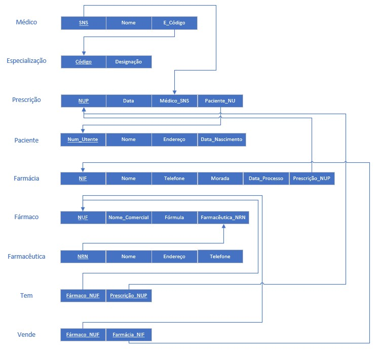

# BD: Guião 3


## ​Problema 3.1
 
### *a)*

```
Ligeiro: TVcodigo, numLugares, portas, combustivel
Pesado: TVcodigo, peso, passageiros
Tipo_Veiculo: codigo, arcondicionado, designacao
Similaridade: TVcodigo1, TVcodigo2
Veiculo: matricula, marca, ano, TVcodigo
Cliente: NIF, nome, endereco, numCarta
Balcao: numero, nome, endereco
Aluguer: numero, duracao, data, client_nif, balcao_numero, veiculo_matricula
```

### *b)* 

```
Cliente:
Chaves Candidatas: NIF, numCarta
Chaves Primária (PK): NIF
Chave(s) Estrangeira(s) (FKs): Não tem

Balcao:
Chaves Candidatas: Numero
Chaves Primária (PK): Numero
Chave(s) Estrangeira(s) (FKs): Não tem

Veiculo:
Chaves Candidatas: Matricula
Chaves Primária (PK): Matricula
Chave(s) Estrangeira(s) (FKs): TVcodigo

Aluguer:
Chaves Candidatas: Matricula
Chaves Primária (PK): Matricula
Chave(s) Estrangeira(s) (FKs):

TipoVeiculo:
Chaves Candidatas: codigo
Chaves Primária (PK): codigo
Chave(s) Estrangeira(s) (FKs): Não tem

Similaridade:
Chaves Candidatas: TVcodigo1 + TVcodigo2
Chaves Primária (PK): TVcodigo1 + TVcodigo2
Chave(s) Estrangeira(s) (FKs): TVcodigo1, TVcodigo2
```


### *c)* 


## ​Problema 3.2

### *a)*

```
AIRPORT: airport_code, state, city, name
CAN_LAND: airport_code, airplane_type_name
AIRPLANE_TYPE: type_name, max_seats, company
AIRPLANE: airplane_id, total_no_of_seats, airplane_type_name
LEG_INSTANCE: date, no_of_avail_seats, airplane_id, departs_time, arrives_time
FLIGHT: number, airline, weekdays
FARE: code, amount, restrictions, flight_number
FLIGHT_LEG: leg_no, flight_number, airport_depar, airport_arr, sch_dep_time, sch_arr_time
SEAT: seat_no, reservation_customer_name, reservation_cphone
```


### *b)* 

```
AIRPORT:
Chaves Candidatas: airport_code, name
Chaves Primária (PK): airport_code
Chave(s) Estrangeira(s) (FKs): none

CAN_LAND:
Chaves Candidatas: airport_code, airplane_type_name
Chaves Primária (PK): airport_code, airplane_type_name
Chave(s) Estrangeira(s) (FKs): airport_code, airplane_type_name

AIRPLANE_TYPE:
Chaves Candidatas: type_name
Chaves Primária (PK): type_name
Chave(s) Estrangeira(s) (FKs): none

AIRPLANE:
Chaves Candidatas: airplane_id
Chaves Primária (PK): airplane_id
Chave(s) Estrangeira(s) (FKs): airplane_type_name

LEG_INSTANCE:
Chaves Candidatas: date, no_of_avail_seats, airplane_id
Chaves Primária (PK): date, no_of_avail_seats, airplane_id
Chave(s) Estrangeira(s) (FKs): airplane_id, departs_time, arrives_time

FLIGHT:
Chaves Candidatas: number
Chaves Primária (PK): number
Chave(s) Estrangeira(s) (FKs): none

FARE:
Chaves Candidatas: code
Chaves Primária (PK): code
Chave(s) Estrangeira(s) (FKs): flight_number

FLIGHT_LEG:
Chaves Candidatas: leg_no, airport_depar, airport_arr
Chaves Primária (PK): leg_no, airport_depar, airport_arr
Chave(s) Estrangeira(s) (FKs): airport_depar, airport_arr

SEAT:
Chaves Candidatas: seat_no, reservation_customer_name
Chaves Primária (PK): seat_no
Chave(s) Estrangeira(s) (FKs): reservation_customer_name, reservation_cphone
```


### *c)* 


## ​Problema 3.3


### *a)* 2.1


### *b)* 2.2



### *c)* 2.3


### *d)* 2.4

