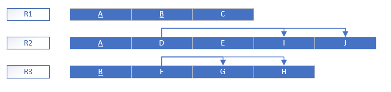

# BD: Guião 7


## ​7.2 
 
### *a)*

<!-- ... Write here your answer ...
It is possible to <u>underline</u> -> {A, B,.. }
-> R1 (_A_, B, C)
-> R2 (B,F) -->
```
A relação está na 1FN (Primeira Forma Normal) uma vez que os seus atributos contêm apenas valores atômicos e não existem relações dentro de relações. Ou seja, cada valor num atributo deve ser indivisível e não pode haver tabelas dentro de tabelas ou conjuntos de valores num único atributo.
```


### *b)*

1FN:


2FN (Segunda Forma Normal):


3FN (Terceira Forma Normal):


## ​7.3
 
### *a)*

```
Primeiramente temos o conjunto de todos os atributos, R = {A, B, C, D, E, F, G, H, I, J}.
Depois, removemos os atributos que aparecem ao lado direito das dependências funcionais visto que são determinados por outros atributos, ou seja, removemos {C, D, E, F, G, H, I, J}.
Ficamos com {A, B} como possíveis chaves.
Verificamos se este conjunto determina todos os outros atributos e como determina, {A, B} é a chave.
```
1FN:


### *b)* 

2FN:



### *c)* 

3FN:


## ​7.4
 
### *a)* 

```
A chave de R é {A, B}.
```


### *b)* 

1FN e 2FN:


3FN:


### *c)* 

BCNF (Boyce-Codd Normal Form):

1FN:


2FN:


3FN:


## ​7.5
 
### *a)*

```
A chave de R é {A, B}.
```

### *b)* 

1FN:


2FN:


### *c)* 


3FN:


### *d)* 

BCNF:

